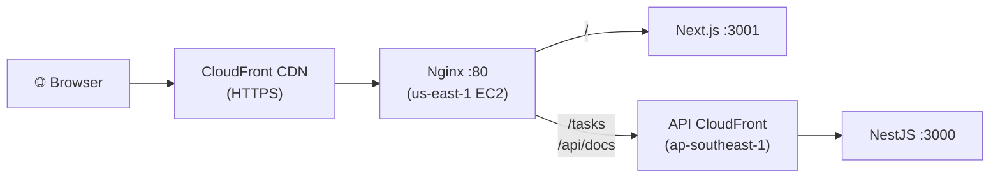

# Personal Task Tracker - Frontend

Modern web frontend built with Next.js, Tailwind CSS, and React Query. Served via CloudFront CDN with Nginx reverse proxy for API routing.

## Tech Stack

- **Framework**: Next.js 16 (App Router)
- **Styling**: Tailwind CSS
- **State Management**: React Query (TanStack Query)
- **HTTP Client**: Axios
- **Shared Logic**: personal-task-tracker-core

## Features

- ✅ Task list with title, status badge, and creation date
- ✅ Filter tasks by status (All, To Do, In Progress, Done)
- ✅ Add new tasks with title and optional description
- ✅ Edit tasks inline via form (title, description, status)
- ✅ Delete tasks with confirmation
- ✅ Mark tasks as complete with a single click
- ✅ Immediate UI updates after API calls
- ✅ Clean, responsive design

## Architecture



The frontend uses a same-origin pattern: browser JS calls `/tasks` on the same CloudFront domain, and Nginx proxies those requests to the API CloudFront distribution in another region.

## Deployed URLs

| Environment | URL |
|-------------|-----|
| Staging | https://d179mmtd1r518i.cloudfront.net |
| Production | https://d1w6dngwkrqpvq.cloudfront.net |

## Development

```bash
npm install
npm run dev           # Development server
npm run build         # Production build
npm start             # Production server
```

## Environment Variables

Create `.env.local`:
```env
NEXT_PUBLIC_API_URL=http://localhost:3000
```

For deployed environments, `NEXT_PUBLIC_API_URL` is the **Frontend CloudFront domain** (same-origin), not the API domain directly.

## Project Structure

```
src/
├── app/
│   ├── layout.tsx          # Root layout with Providers
│   ├── page.tsx            # Home page with TaskList
│   └── globals.css         # Global styles
├── components/
│   ├── Providers.tsx       # React Query provider
│   ├── TaskList.tsx        # Main task list container
│   ├── TaskItem.tsx        # Individual task card
│   ├── TaskForm.tsx        # Add/Edit task form
│   └── StatusFilter.tsx    # Status filter buttons
├── hooks/
│   └── useTasks.ts         # React Query hooks for CRUD
└── lib/
    └── api.ts              # Axios API client
```

## Deployment

Deployed via the [orchestration repo](https://github.com/nurulizyansyaza/personal-task-tracker) CI/CD pipeline. Runs on EC2 (us-east-1) behind CloudFront CDN with Nginx reverse proxy.
