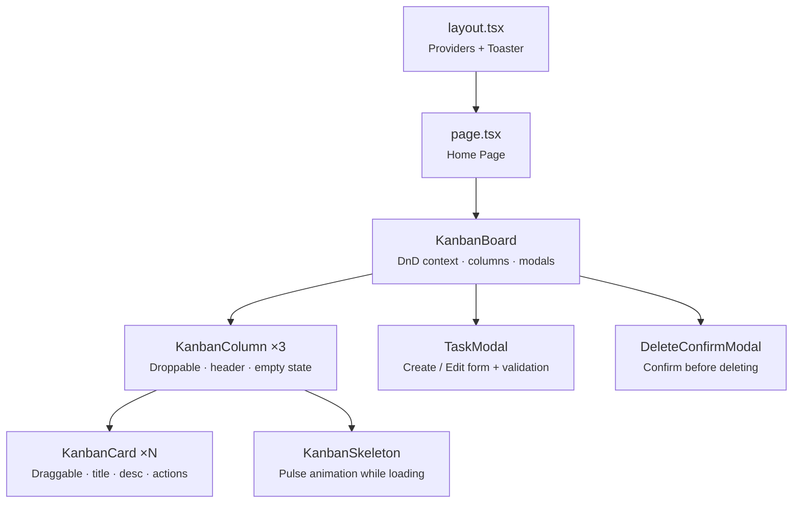
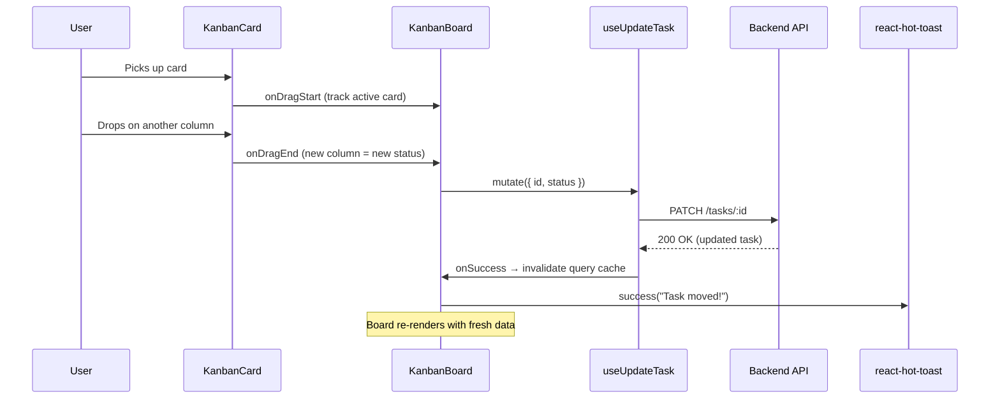
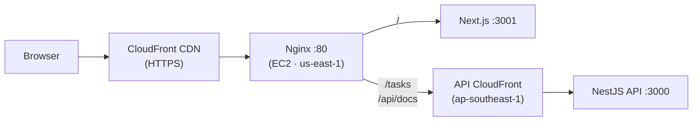

# Personal Task Tracker — Frontend

A **Kanban-style task management board** built with Next.js, React, and TypeScript.
Drag tasks between columns, create and edit them in modals, and watch status updates happen instantly — all wrapped in a responsive, accessible UI.

> **New to this project?** This README walks you through everything from installing dependencies to understanding the architecture. No prior Next.js experience required.

---

## Tech Stack

| Category | Technology | Version |
|----------|-----------|---------|
| **Framework** | [Next.js](https://nextjs.org/) (App Router, Turbopack) | 16.2.1 |
| **UI Library** | [React](https://react.dev/) | 19 |
| **Language** | [TypeScript](https://www.typescriptlang.org/) | 5 |
| **Styling** | [Tailwind CSS](https://tailwindcss.com/) | 4 |
| **Drag & Drop** | [@dnd-kit](https://dndkit.com/) (core, sortable, utilities) | — |
| **Server State** | [@tanstack/react-query](https://tanstack.com/query) | 5 |
| **HTTP Client** | [Axios](https://axios-http.com/) | — |
| **Notifications** | [react-hot-toast](https://react-hot-toast.com/) | — |
| **Shared Types** | `personal-task-tracker-core` (local `file:` dependency) | — |

---

## Features

- **Kanban board** with three columns — *To Do*, *In Progress*, and *Done*
- **Drag-and-drop** task cards between columns; status auto-updates on drop
- **Mark as done** with a single-click checkbox on each card (toggles between Done and To Do)
- **Sort tasks** by creation date (newest/oldest) or status via a dropdown
- **Create tasks** via a modal form with title and description
- **Edit tasks** in the same modal (pre-filled with current values)
- **Delete tasks** with a confirmation modal (no accidental deletes)
- **Offline fallback** — tasks are cached in localStorage; the board still works when the API is unreachable
- **Toast notifications** for every action — success *and* error
- **Loading skeletons** while data is being fetched
- **Responsive layout** — single column on mobile, three columns on desktop
- **Error state** with a friendly message when the API is unreachable

---

## Quick Start

### Prerequisites

| Tool | Version | How to check | How to install |
|------|---------|-------------|----------------|
| Node.js | >= 18 | `node -v` | [nodejs.org](https://nodejs.org/) |
| npm | >= 9 | `npm -v` | Included with Node.js |

> **Note:** You also need the backend API running, or set `NEXT_PUBLIC_API_URL` to a remote instance.

### Install & Run

```bash
# 1. Clone the repo (if you haven't already)
git clone https://github.com/nurulizyansyaza/personal-task-tracker.git
cd personal-task-tracker/personal-task-tracker-frontend

# 2. Install dependencies (also links the shared core package)
npm install

# 3. Create a local environment file
cp .env.example .env.local # or create it manually (see Environment Variables)

# 4. Start the dev server (uses Turbopack for fast refresh)
npm run dev
```

Open **http://localhost:3001** in your browser — you should see the Kanban board.

| Command | What It Does |
|---------|-------------|
| `npm run dev` | Start development server with hot reload |
| `npm run build` | Create an optimised production build |
| `npm start` | Serve the production build |
| `npm test` | Run the full test suite |
| `npm run test:watch` | Run tests in watch mode |

---

## Component Architecture

The diagram below shows how components nest inside each other:



**Key idea:** `KanbanBoard` owns all state — which modal is open, which task is selected, and the drag-and-drop context. Each column simply receives its list of cards.

---

## Drag & Drop Flow

Here's what happens when you drag a card from one column to another:



If the API call fails, the board shows an **error toast** and the task stays in its original column (no optimistic updates that could mislead you).

---

## API Integration

All server communication lives in two files:

### `lib/api.ts` — Axios Client with Offline Fallback

Creates a configured Axios instance pointing at `NEXT_PUBLIC_API_URL`. Exposes a `taskApi` object.
When the API is unreachable, `getAll`, `create`, `update`, and `delete` fall back to `localStorage` so the board remains functional offline.

| Method | Endpoint | Offline Behaviour |
|--------|----------|-------------------|
| `taskApi.getAll()` | `GET /tasks` | Returns cached tasks from localStorage |
| `taskApi.getById(id)` | `GET /tasks/:id` | No fallback (throws) |
| `taskApi.create(data)` | `POST /tasks` | Creates with a negative local ID |
| `taskApi.update(id, data)` | `PUT /tasks/:id` | Updates the local cache |
| `taskApi.delete(id)` | `DELETE /tasks/:id` | Removes from local cache |

### `lib/local-storage.ts` — localStorage Cache

Persists tasks under the `ptt_tasks_cache` key. Synced automatically on every successful API fetch.

### `hooks/useTasks.ts` — React Query Hooks

Wraps every API call in a React Query hook so the UI stays in sync automatically:

| Hook | Purpose |
|------|---------|
| `useTasks()` | Fetches all tasks; returns `{ data, isLoading, isError }` |
| `useCreateTask()` | Returns a `mutate` function; invalidates the task list on success |
| `useUpdateTask()` | Same pattern — used for edits *and* drag-and-drop status changes |
| `useDeleteTask()` | Deletes and invalidates; used by the delete confirmation modal |

> **Why React Query?** It handles caching, background refetching, and loading/error states out of the box — so you don't have to manage any of that yourself.

---

## Testing

The project has **94 tests** across **12 test suites** using Jest, React Testing Library, and @testing-library/user-event.

### Run Tests

```bash
# Run all tests once
npm test

# Run in watch mode (re-runs on file changes)
npm run test:watch

# Run with coverage report
npm test -- --coverage
```

### Test Suites at a Glance

| Suite | File | Tests | What It Covers |
|-------|------|:-----:|----------------|
| API Client | `api.test.ts` | 13 | getAll, getById, create, update, delete, offline fallback |
| Local Storage | `local-storage.test.ts` | 10 | CRUD, sync from API, clear, malformed data |
| React Query Hooks | `useTasks.test.ts` | 6 | All four hooks, cache invalidation |
| Task Modal Hook | `useTaskModal.test.ts` | 6 | Open/close, create/edit modes, submit callbacks |
| Delete Hook | `useDeleteConfirmation.test.ts` | 5 | Open/close, confirm, guard when no task |
| Sort Hook | `useTaskSort.test.ts` | 8 | All sort options, cycling, invalid index, undefined |
| Status Config | `status-config.test.ts` | 4 | Labels, colors, column config, column order |
| Kanban Card | `KanbanCard.test.tsx` | 11 | Rendering, edit/delete, checkbox toggle, status styles |
| Kanban Column | `KanbanColumn.test.tsx` | 8 | Header text, card rendering, empty states, loading skeleton |
| Kanban Skeleton | `KanbanSkeleton.test.tsx` | 3 | Default skeleton count, custom count |
| Task Modal | `TaskModal.test.tsx` | 12 | Create/edit modes, validation, form submission, loading state |
| Delete Modal | `DeleteConfirmModal.test.tsx` | 7 | Rendering, confirm action, cancel action, loading state |

---

## Project Structure

```
src/
├── app/
│ ├── layout.tsx # Root layout — wraps app in Providers + Toaster
│ ├── page.tsx # Home page — renders <KanbanBoard />
│ └── globals.css # Tailwind base styles
│
├── components/
│ ├── Providers.tsx # QueryClientProvider (React Query)
│ └── kanban/
│   ├── index.ts # Barrel export for clean imports
│   ├── KanbanBoard.tsx # Main board: DnD context, columns, modals
│   ├── KanbanColumn.tsx # Droppable column: header, card list, empty state
│   ├── KanbanCard.tsx # Draggable card: title, description, action buttons
│   ├── KanbanSkeleton.tsx # Animated loading placeholder
│   ├── TaskModal.tsx # Create / Edit modal with form validation
│   └── DeleteConfirmModal.tsx # "Are you sure?" confirmation modal
│
├── hooks/
│ ├── useTasks.ts # React Query CRUD hooks
│ ├── useTaskSort.ts # Client-side sort by date or status
│ ├── useTaskModal.ts # Modal open/close/submit state management
│ └── useDeleteConfirmation.ts # Delete confirmation state management
│
├── lib/
│ ├── api.ts # Axios instance + taskApi helper (with offline fallback)
│ ├── local-storage.ts # localStorage cache for offline support
│ └── status-config.ts # Shared status labels, colors, column config
│
└── test/
  └── mocks.ts # Shared mock task factory for tests
```

---

## Environment Variables

Create a `.env.local` file in the project root:

```env
# URL the browser uses to call the API.
# In development this is usually the local backend:
NEXT_PUBLIC_API_URL=http://localhost:3000
```

| Variable | Required | Description |
|----------|:--------:|-------------|
| `NEXT_PUBLIC_API_URL` | | Base URL for all API requests. Baked into the JS bundle at **build time**. |

> **Deployed environments:** Set this to the **frontend's own CloudFront domain** (same-origin), not the API domain directly. Nginx on the EC2 instance proxies `/tasks` and `/api/docs` to the API CloudFront distribution.

---

## Deployment

### Infrastructure Overview



### Deployed URLs

| Environment | URL |
|-------------|-----|
| **Staging** | `https://d179mmtd1r518i.cloudfront.net` |
| **Production** | `https://d1w6dngwkrqpvq.cloudfront.net` |

### How It Works

1. **CloudFront** terminates HTTPS and caches static assets.
2. **Nginx** on an EC2 instance in `us-east-1` routes requests:
 - `/` → Next.js server (port 3001)
 - `/tasks` and `/api/docs` → API CloudFront distribution in `ap-southeast-1`
3. This **same-origin pattern** means the browser never calls a different domain — avoiding CORS issues entirely.

Deployment is automated via the [orchestration repo](https://github.com/nurulizyansyaza/personal-task-tracker) CI/CD pipeline.

---

## Error Handling

Every user action produces feedback via **react-hot-toast**:

| Action | Success Toast | Error Toast |
|--------|--------------|-------------|
| Create task | "Task created!" | "Failed to create task" |
| Edit task | "Task updated!" | "Failed to update task" |
| Delete task | "Task deleted!" | "Failed to delete task" |
| Drag & drop | "Moved to [column]" | "Could not move task" |
| Mark as done | "Task completed!" | "Could not update task" |
| Unmark done | "Task reopened" | "Could not update task" |

**If the API is completely unreachable**, the board shows a full-screen error state with a friendly message and a retry button — no cryptic error dumps.

---

## License

See the root [LICENSE](../LICENSE) file for details.

---

## Related Repositories

| Repo | Description | Tests |
|------|-------------|-------|
| [personal-task-tracker](https://github.com/nurulizyansyaza/personal-task-tracker) | Orchestration — CI/CD, Docker, AWS infra | — |
| [personal-task-tracker-core](https://github.com/nurulizyansyaza/personal-task-tracker-core) | Shared TypeScript library — types, validation, errors | 42 |
| [personal-task-tracker-api](https://github.com/nurulizyansyaza/personal-task-tracker-api) | NestJS REST API with security middleware | 84 |
| [personal-task-tracker-frontend](https://github.com/nurulizyansyaza/personal-task-tracker-frontend) | Next.js Kanban dashboard | 94 |
